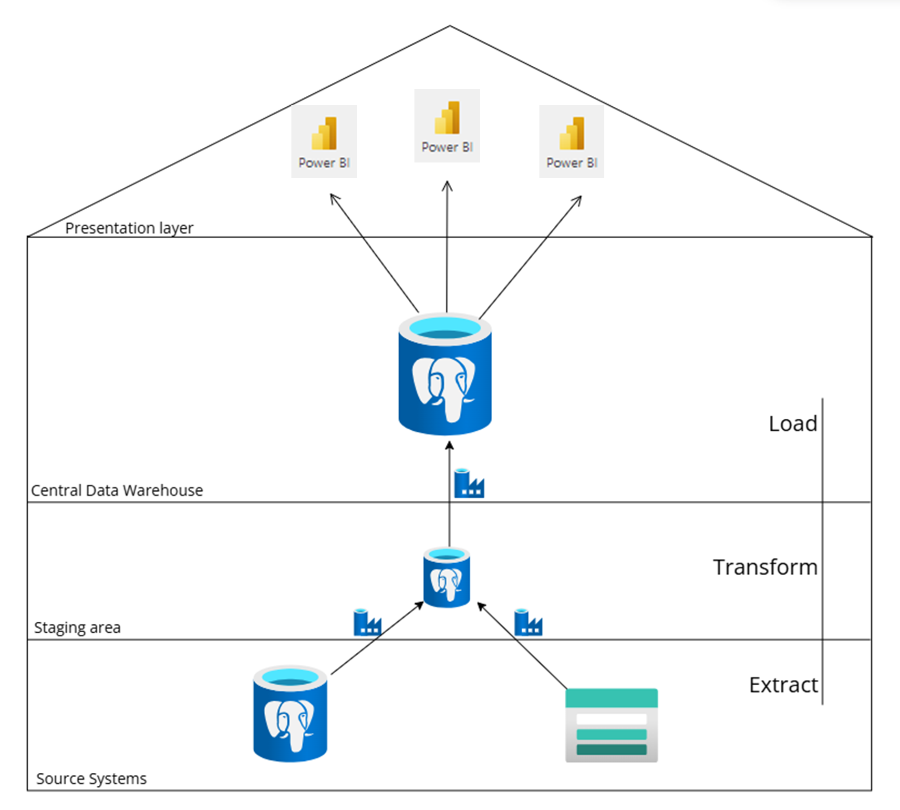
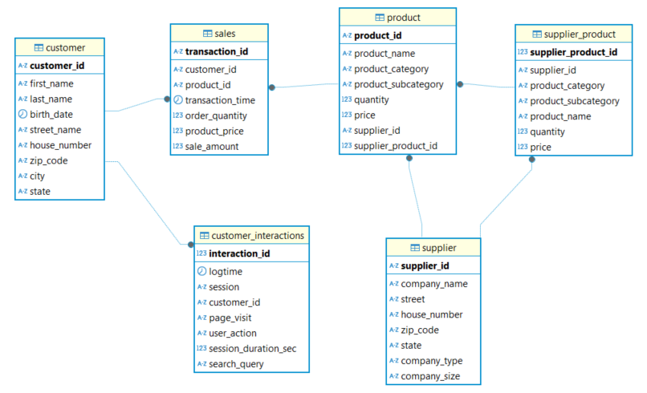
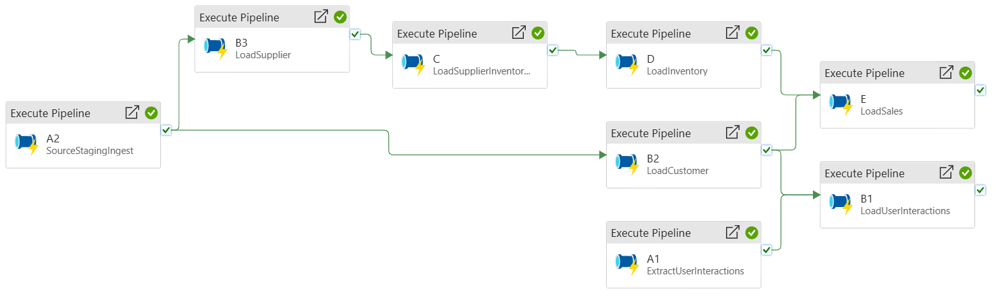
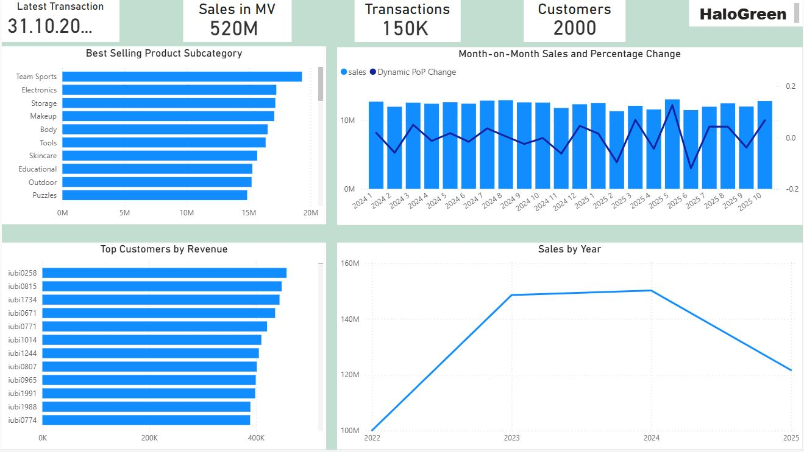

# HaloGreen – ETL-Prozess für einen Online-Shop

## Kontext

Dieses Projekt wurde als Leistungsnachweis im Masterkurs **ETL-Technologien** an der **IU Internationale Hochschule** erstellt. Es demonstriert die praktische Implementierung eines kompletten ETL-Prozesses mit modernen Cloud-Technologien und Best Practices in der Datenintegration und Business Intelligence.

## Projektübersicht

HaloGreen ist ein Online-Shop, der einen umfassenden ETL-Prozess (Extract, Transform, Load) benötigt, um Daten aus verschiedenen Quellen in ein zentrales Data Warehouse zu integrieren. Dieses Projekt implementiert eine vollständige Datenpipeline zur Extraktion, Transformation, Laden und Analyse von Geschäftsdaten.

## Aufgabenstellung

### Anforderungen

#### 1. Datenquellen (3 Quellen)

- **Quelle 1 - Relationale Datenbank (Sales)**: Enthält Kundendaten, Produktdetails, Kaufdaten und Verkaufsinformationen
- **Quelle 2 - CSV-Datei (Inventar)**: Produktinformationen wie Produkt-ID, Name, Kategorie, verfügbare Menge sowie Lieferanten Information.
- **Quelle 3 - Log-Datei (User Interactions)**: Webseiten-Interaktionen, Klicks, Suchanfragen, Nutzerverhalten und Session-Dauer

Da konkrete Daten nicht bereitgestellt wurden, wurden diese in python generiert. Die Daten sind im Ordner
*datasets* abgelegt. Die python Skripte für die Datengenerierung sind ebenfalls im Hauptorderzu finden. Basierend auf die Anforderungen und Daten von HaloGreen wurde das folgen Data Warehouse konzipiert und implementiert.

#### 2. Quellsysteme

Die generierten Sales- und Inventardaten werden in einer Azure Database for PostgreSQL (flexible server) gespeichert, während die Log-Dateien der Kundeninteraktionen auf dem HaloGreen-Webshop in einem Container des Azure Blob Storage archiviert sind. Die Quellsysteme bestehen somit aus zwei integrierten Komponenten: **Azure Database for PostgreSQL (flexible server)** für strukturierte Transaktionsdaten und **Azure Blob Storage** für semi-strukturierte Log-Daten.

#### 3. Die Staging Area

Die Staging Area wird auf einem flexiblen Azure Database for PostgreSQL-Server implementiert, der als separate, unabhängige Instanz vom Quellsystem betrieben wird. Diese physische Trennung ermöglicht eine sichere Zwischenspeicherung und Transformation der extrahierten Daten, bevor diese in das Core Data Warehouse geladen werden. 

#### 4. Core Data Warehouse (3NF)

Das zentrale Data Warehouse wird in der 3. Normalform (3NF) normalisiert und wird durch das ETL-Prozess mit Daten befüllt. Ein 3NF dient der Datenkonsistenz und Integrität. Dieses wird wiederum auf eine separate, unabhängige flexible Azure Database for PostgreSQL Instanz implementiert. Eine separate Instanz von der Staging Area sowie Quellsystem ist für die Skalierbarkeit und Leistung des Systems wichtig. Das SQL Skript für die Implementierung des 3NF
DatenModell liegt im sql_scripts Ordner und das folgende Bild in das Datenmodell im Datenbank.

#### 5. Das ETL-Prozess

Das ETL-Prozess ist mit Azure Data Factory implementiert worden. Die beide folgende Bilder zeigen die erfolgreiche Ausführung des ETL-Prozesses in Azure mit Azure Data Factory.

*Abbildung: Übersicht der Pipeline-Orchestrierung für den ETL-Prozess.*

*Abbildung: Gantt-Diagramm zur Ausführungsplanung der ETL-Pipelines.*

#### 6. Data Marts (3 Marts)

Aus dem Core DWH werden drei spezialisierte Data Marts in Power BI erstellt. D.H Mit Power BI werden die Daten im zentralen DWH zugegriffen, importiert, manipuliert und entsprechenden Data Marts für die gewünschten Analyse in Power BI erstellt. Folgende in die drei Data Marts die erstellt worden sind.

- **Sales Data Mart**: Fokus auf Verkaufsdaten und Umsatzanalysen
- **Inventory Data Mart**: Fokus auf Bestandsverwaltung
- **Customer Behavior Data Mart**: Fokus auf Kundenverhalten

#### 7. Geschäftsmetriken (KPIs)

Der ETL-Prozess berechnet und aggregiert folgende Schlüsselmetriken:

- Gesamtumsatz pro Kunde
- Gesamtumsatz pro Produktkategorie bzw.Produktunterkategorie
- Bestandsquoten pro Kategorie

##### 1. Sales Analyse
 

*Abbildung: Verkaufsanalyse — Beispiel-Dashboard.*

